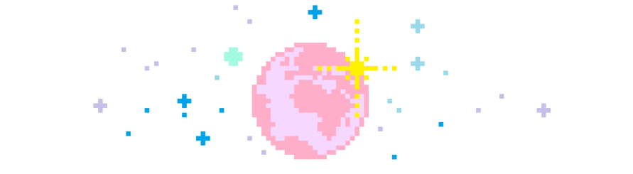

  

**Coding for fun 💻✨** Isso significa que a maioria dos projetos aqui são apenas insanidades que surgiram na minha cabeça às 2 da manhã.

* 🔭 **Atualmente brincando com:** [Aprendendo a fazer sites.]
* 🌱 **Tentando entender:** [TS e C#.]
* ⚡ **Fato divertido:** [Meu Curso real esta a KM/Luz de Progamação.]

<picture>
  <source media="(prefers-color-scheme: dark)" srcset="https://raw.githubusercontent.com/LariMagick/LariMagick/output/github-contribution-grid-snake-dark.svg">
  <source media="(prefers-color-scheme: light)" srcset="https://raw.githubusercontent.com/LariMagick/LariMagick/output/github-contribution-grid-snake.svg">
  
</picture>
